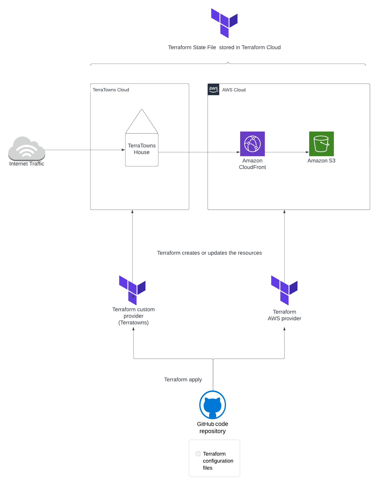

# Terraform Beginner Bootcamp 2023

This project has been created as part of the [Terraform Cloud Project bootcamp](https://terraform.cloudprojectbootcamp.com). 

The code in this repository contains Go code to create a Terraform custom provider called 'Terratowns' as well as resource code to create resources using the custom provider and the AWS provider. The below diagram describes the main components on the project:

## Structure of the Project

### Custom Provider

The structure used to create the Terraform custom provider can be found in the ``terraform-provider-terratowns`` directory. A mock server that was used during the creation of the custom provider can be found in the ``terratowns_mock_server`` directory. The ``bin`` directory contains bash scripts that are used for installing resources and to create the custom provider as well as scripts for testing the mock server. 

The full process of creating a custom provider is described in further detail in an article I wrote: [my blog article](https://blog.marikabergman.com/creating-a-terraform-custom-provider-terraform-cloud-project-beginner-bootcamp?showSharer=true)

## Resources

The root level ``main.tf`` contains HCL code to use the custom provider to create 'terratowns_home' resources at Terratowns cloud. It also creates a 'terrahome_aws' module. This module contains nested modules - one for creating a CloudFront distribution and invalidation and another for creating the S3 bucket.

### Weekly Journals

The journal directory contains a weekly journal covering topics that were covered during each week of the bootcamp:

- [Week 0 Journal](journal/week0.md)
- [Week 1 Journal](journal/week1.md)
- [Week 2 Journal](journal/week2.md)
